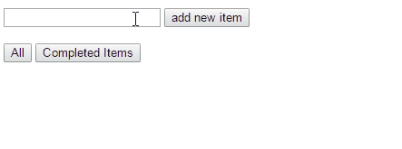

# Todo List: Redux with jQuery Example
Redux是用來管理狀態(state)的框架，可以和React、Angular、jQuery甚至Pure JavaScript一起使用。
以下就簡單使用jQuery實作Todo List。

## 功能介紹
先來看看完成的樣子。

功能有：

- 新增一個task
- 修改task名稱
- 刪除一個task
- 更改task狀態為完成/未完成
- 切換filter，選擇呈現全部或已完成的task

## 實作
程式碼主要分成三個部份：

- Reducer：更新state的函式，嚴格限制相同輸入要能得到相同輸出(functional programming的概念)
- Action：通知有事情發生，必須更新state
- Store：儲存state的地方，用來連接Action和Reducer

由以上可知，這個Todo List裡面存的資料就是狀態，只要狀態更新，例如新增task、標示一個task為完成，就重新繪製Todo List區塊。而「新增task、標示一個task為完成」都是動作(Action)，動作會告知狀態更新，狀態一改變，Store就會做指定的事情，例如重繪元件。

### Reducer
更新state的函式，輸入值是目前的狀態和動作，輸出值是下一個狀態。

這裡宣告了一個reducer「todos」，初始值是一個物件，包含todos(todo list的內容)、filter(目前呈現的內容，可以是全部all或已完成completed)、counter(指示下一個新增task的ID)。

每當Action通知狀態改變時，除了要代入Action Type外，還要代入需要的資料。
Action Type可能是「ADD_TODO」等，需要的資料像是task名稱(`actions.name`)，如下範例所示。

    const todos = (state = { todos: [], filter: 'all', counter: 0 }, actions) => { //輸入值：目前的狀態和動作
      switch(actions.type) {
        case 'ADD_TODO':
          state.todos.push({
            id: state.counter++,
            name: actions.name,
            completed: false
          });
          break;

        //以下省略...
      }

      return state; //輸出值：下一個狀態
    }

### Action
用來通知有事情發生，必須更新state。

如下所示，當我們按下新增按鈕來增加一個task時，就會到input抓取使用者輸入的文字來更新state－使用`store.dispatch`來更新狀態，其中要傳入動作類別「ADD_TODO」和剛抓取的使用者的輸入內容「newValue」。

    $('.add').click(() => {
      var newValue = $('.input_new_item').val();

      if(newValue) {
        store.dispatch({
          type: 'ADD_TODO',
          name: newValue
        });
      }
    });

### Store
儲存state的地方，用來連接Action和Reducer。

有以下幾種方法：

- getState()：取得目前狀態
- dispatch(action)：更新狀態，例如剛剛的例子，新增一個task
- subscribe(listener)：註冊監聽器

當我們想知道目前的狀態時，就可以用`getState()`取得。

  	var state = todosStore.getState(); //取得目前Todo List的內容

更新狀態就使用`dispatch(action)`，同上Action增加一個task的範例。

使用`subscribe(listener)`監聽狀態，狀態改變就更新UI。

	  todosStore.subscribe(() => {
	    //監聽狀態，狀態改變就更新UI
	  });

以上的範例原始碼在[這裡](https://github.com/cythilya/todolist_redux_with_jquery_example)，有興趣的話可以參考看看。

---
## 參考資料
- [Read Me · Redux](http://redux.js.org/)
- [Redux 中文文檔](http://cn.redux.js.org/index.html)
- [Redux with jQuery example](https://codepen.io/mdd/full/wGRqbw/)